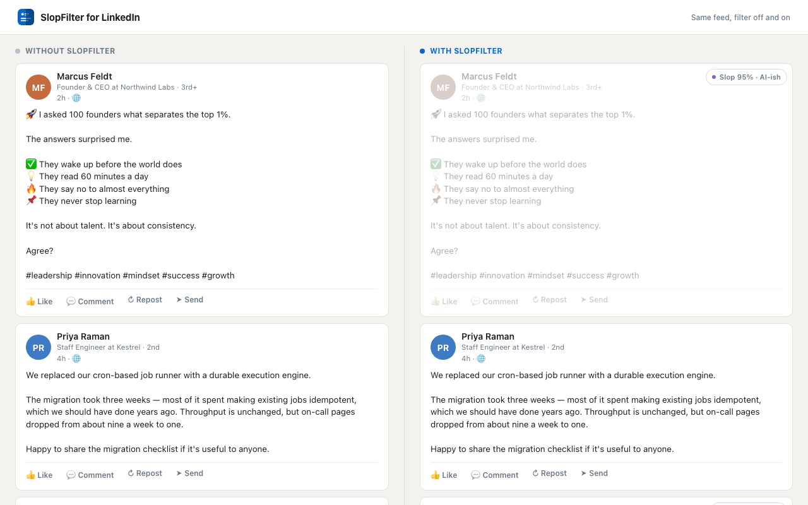
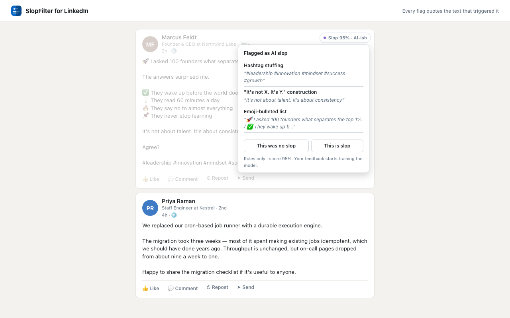
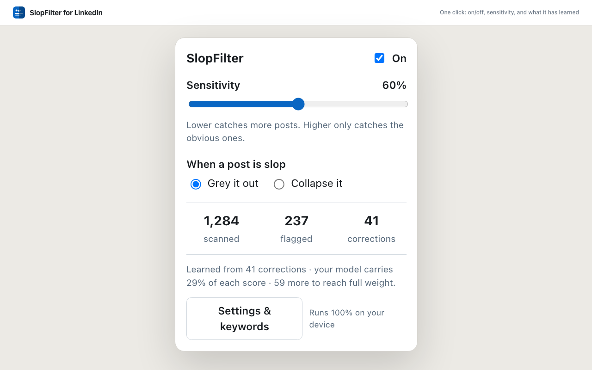
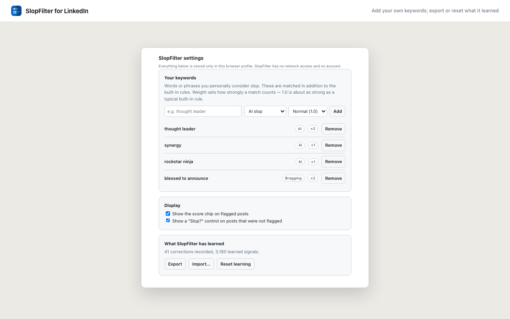

# SlopFilter for LinkedIn

Works for English and German LinkedIn feeds.

This extensions allows you to grey out or completely hide LinkedIn Posts, that are likely created mostly by AI. It runs fully locally, with no network access or traffic and compares the posts against a list of patterns and words typically used by large language models.

The model is mostly based on logistic regression and learns based on your feedback on Posts (e.g., marking them as slop or the reverse).

There is no visible impact on performance, not blocking DOM buildup and using ca. 0.3ms per Post for classification. 

**Everything runs on your device.** The extension requests no network permission at all, so it is
structurally incapable of sending your feed anywhere. No account, no server, no telemetry.

---

## Screenshots

The same feed with the filter off and on. Slop is greyed out, never removed — hover to read it
normally.



Every flag quotes the text that triggered it, and both corrections are one click away.



| Popup                                  | Settings                                        |
| -------------------------------------- | ----------------------------------------------- |
|  |  |

The posts shown are invented, and so are the names — no real feed content appears in this repo.
Every score and every quoted reason is genuine output from the scoring engine, produced by
`npm run screenshots`, which regenerates all of it from
[`tools/screenshots/`](tools/screenshots/) so the images cannot drift from the real UI.

---

## Install

Not yet on the Chrome Web Store. To run it now:

```bash
npm install && npm run build
```

Then open `chrome://extensions`, turn on **Developer mode**, click **Load unpacked**, and select the
`dist/` folder. Open your LinkedIn feed.

## How it decides

Two layers. The first is a catalogue of hand-written heuristics in
[`src/engine/rules.ts`](src/engine/rules.ts), each of which quotes the text that made it fire — so
every flag is explainable rather than a black-box score.

**AI-slop signals** include fake bold (the unicode lookalike characters a "LinkedIn text formatter"
produces), emoji-bulleted lists, one-line-per-thought cadence, the `It's not X. It's Y.`
construction, formulaic hooks ("Unpopular opinion:", "Let that sink in."), engagement bait
("Agree?", "Comment 'X' and I'll send you…"), LLM vocabulary (delve, tapestry, paradigm shift), em-dash
density, unnaturally even sentence lengths, and hashtag stuffing.

**Bragging-slop signals** include announcement humblebrags ("Thrilled to announce…"), performative
humility ("humbled and honored", "I don't usually post about this, but"), numbers flexes, the
story-with-a-moral template, and the hook→story→pitch pivot ("That is why we built…" followed by a
tracked `lnkd.in` call to action).

**English and German are both covered.** Every phrase list carries both languages and both are
always active, since a German-language feed is full of English posts and vice versa. The structural
rules — fake bold, emoji bullets, cadence, hashtag stuffing — are language-independent already.

The rules are summed and squashed onto a 0–1 score by a saturating curve, so a long post cannot get
flagged merely for being long.

The second layer is a logistic-regression classifier that trains **in your browser** on your
corrections. It sees the post's words _and which rules fired_, which means the most useful thing it
can learn is which of the built-in heuristics you personally disagree with.

The two are blended:

```
α     = min(0.7, corrections / 100 × 0.7)
score = (1 − α) × rules + α × your model
```

At zero corrections it is pure heuristics. The rules never drop below 30% of the vote, so a handful
of unlucky corrections cannot invert the filter on posts unlike anything you have labelled.

## Feedback

Every flagged post gets a chip. Click it for the reasons, then **This was no slop** or **This is
slop**. Posts that were _not_ flagged get a quiet "Slop?" control on hover, so feedback flows both
ways. Corrections are stored locally and can be exported to JSON from the options page.

You can also add your own keyword rules, at three strengths, in the extension's settings.

## Development

```bash
npm install
npm test          # 69 tests
npm run lint      # eslint + prettier
npm run typecheck
npm run build     # -> dist/
npm run zip       # -> slopfilter-<version>.zip for the Web Store
npm run screenshots # -> docs/screenshots/ (needs Chrome)
```

The scoring engine in `src/engine/` is pure — no DOM, no `chrome.*` — and is tested against a corpus
of labelled posts in [`tests/fixtures/posts.ts`](tests/fixtures/posts.ts). It currently gets 38 of 39
right with **zero false positives** on the 18 genuine posts, including deliberately tricky ones (an
enthusiastic team-credit post, a technical writeup that uses em-dashes normally, a plainly-worded
career change, a substantive German post about a security incident). Contributions to the corpus are
the most useful contributions there are — if SlopFilter flags something it shouldn't, a fixture
reproducing it is worth more than a bug report.

### Layout

| Path           | What it does                                                      |
| -------------- | ----------------------------------------------------------------- |
| `src/engine/`  | Pure scoring: tokenizing, rules, classifier, blending             |
| `src/content/` | LinkedIn DOM: selectors, extraction, dimming, feedback UI         |
| `src/storage/` | Typed `chrome.storage.local` wrapper, feedback log, import/export |
| `src/popup/`   | Toolbar popup: on/off, sensitivity, stats                         |
| `src/options/` | Keyword editor, display options, model export/reset               |

Every LinkedIn DOM assumption lives in [`src/content/selectors.ts`](src/content/selectors.ts). LinkedIn
changes its markup without notice, so each lookup is a chain of fallbacks, and the popup reports
"no posts recognised" instead of failing silently. **If SlopFilter stops flagging anything, that file
is where to look first.**

As of the 2026 redesign LinkedIn ships hashed class names (`_4633da7f`) and no `data-urn`, so the
old `.feed-shared-update-v2[data-urn]` selectors match nothing. What the extension keys off now:

| Hook                                            | Used for                                |
| ----------------------------------------------- | --------------------------------------- |
| `componentkey^="expanded"…"FeedType_MAIN_FEED"` | Post containers, and the stable post id |
| `[data-testid="mainFeed"]`                      | The feed root to observe                |
| `[data-testid="expandable-text-box"]`           | Post body text                          |
| Most-repeated `/in/` or `/company/` link        | Post author                             |

None of these carry localized text, so they work identically on a German and an English feed. The
legacy selectors are kept behind the new ones for anyone still on an older rollout, and
`tests/fixtures/feed-post.html` covers both.

One subtlety worth knowing before touching extraction: LinkedIn separates paragraphs with `<br>`
elements, which `textContent` drops entirely — collapsing a post into a single line and silently
disabling every line-based rule. `readText()` in [`extract.ts`](src/content/extract.ts) walks the
tree instead, which is why it exists rather than a one-liner.

## Privacy

See [PRIVACY.md](PRIVACY.md). Short version: the extension asks for `storage` and nothing else.
It declares **no host permissions**; its whole reach is the content script's match pattern,
`https://www.linkedin.com/feed/*`. No network permission, so it sends nothing anywhere.

## A note on LinkedIn's terms

SlopFilter only restyles pages you are already logged into and already viewing, in your own browser
— the same category of thing as an ad blocker or a reader-mode extension. It does not automate
actions on your account, scrape at scale, or talk to LinkedIn's servers on your behalf. That said,
LinkedIn's user agreement discourages various forms of automation and it is their platform. Use it
with that in mind.

## License

[MIT](LICENSE).
